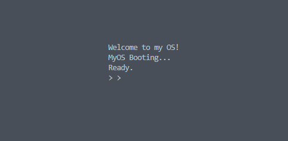

# 🚀 Operating Systems – Worksheet 2  

## 📘 Overview  
This project extends our simple OS kernel by adding **keyboard input**, **interrupt handling**, and a **mini terminal (shell)**.  
We move from a framebuffer-only system to a kernel that interacts with hardware using:

- 🖥️ I/O Ports  
- ⚡ Programmable Interrupt Controller (PIC)  
- 🧱 Interrupt Descriptor Table (IDT)  
- ⌨️ Keyboard Interrupts  
- 🔤 Scan-code → ASCII conversion  
- 📦 Input buffer (`getc`, `readline`)  
- 💻 A basic shell with commands  

This README includes all required explanation and references to code files implemented in this worksheet.

---

# Understanding Hardware Interrupts  
Interrupts allow external devices (like the keyboard) to signal the CPU.  
When a key is pressed:

1. The keyboard hardware sends a **scan code** to port `0x60`
2. PIC signals IRQ1
3. CPU jumps into interrupt vector `33` (0x21)
4. Our assembly interrupt handler runs
5. C-level handler processes the scan code
6. Character is converted to ASCII and stored/displayed

This mechanism builds our foundation for terminal input.

---

## 🚀 Build Instructions

### Build:
```bash
make
```

### Run:
```bash
make run
```

If GTK fails:
```bash
make run-headless
```

Generates:
```
os.iso
kernel.elf
```

---

## 📁 Project Structure
```
Worksheet-2/
│
├── boot/
│   └── boot.s
│
├── kernel/
│   ├── kernel_entry.s
│   ├── kernel.c
│   ├── interrupts.c
│   ├── interrupt_handlers.s
│   ├── interrupt_asm.s
│   ├── pic.c
│   ├── keyboard.c
│   ├── fb.c
│   ├── input_buffer.c
│   └── terminal.c
│
├── include/
│   ├── terminal.h
│   ├── fb.h
│   ├── keyboard.h
│   ├── interrupts.h
│   ├── input_buffer.h
│   ├── io.h
│   └── pic.h
│
├── link.ld
├── Makefile
└── README.md
```

---

# 🛠 Makefile
```make
ASM = nasm
CC = gcc

CFLAGS = -m32 -ffreestanding -nostdlib -fno-pie -fno-stack-protector -Iinclude
ASFLAGS = -f elf32

OBJS =  boot/boot.o \
        kernel/kernel_entry.o \
        kernel/kernel.o \
        kernel/interrupts.o \
        kernel/interrupt_handlers.o \
        kernel/interrupt_asm.o \
        kernel/pic.o \
        kernel/keyboard.o \
        kernel/fb.o \
        kernel/input_buffer.o \
        kernel/terminal.o

all: kernel.elf os.iso

kernel.elf: $(OBJS)
	ld -m elf_i386 -T link.ld -o kernel.elf $(OBJS)

%.o: %.c
	$(CC) $(CFLAGS) -c $< -o $@

%.o: %.s
	$(ASM) $(ASFLAGS) $< -o $@

os.iso: kernel.elf
	rm -rf iso
	mkdir -p iso/boot/grub
	cp kernel.elf iso/boot/kernel.elf
	echo 'set timeout=0' > iso/boot/grub/grub.cfg
	echo 'set default=0' >> iso/boot/grub/grub.cfg
	echo 'menuentry "MyOS" { multiboot /boot/kernel.elf }' >> iso/boot/grub/grub.cfg
	grub-mkrescue -o os.iso iso

run:
	qemu-system-i386 -m 64 -cdrom os.iso

run-headless:
	qemu-system-i386 -m 64 -cdrom os.iso -nographic

clean:
	rm -rf kernel.elf os.iso iso $(OBJS)
```

---

# 🧩 link.ld
```ld
ENTRY(start)

SECTIONS {
    . = 1M;

    .text : {
        *(.text*)
    }

    .rodata : {
        *(.rodata*)
    }

    .data : {
        *(.data*)
    }

    .bss : {
        *(COMMON)
        *(.bss*)
    }
}
```

---

# 🧩 boot/boot.s

**Description:**
This file contains the Multiboot header that allows GRUB to detect and load your OS. GRUB jumps to the `start` label, which then hands execution to `kernel_entry`. After that, it halts the CPU in a safe loop.


**Description:**  
This file contains the GRUB Multiboot header, which tells GRUB that your kernel is Multiboot-compliant.  
GRUB loads your kernel into memory, then jumps to the `start` label.  
From there, the bootloader calls `kernel_entry` (located in `kernel_entry.s`) to pass execution into your kernel.


```asm
MULTIBOOT_HEADER_MAGIC equ 0x1BADB002
MULTIBOOT# 🧩 kernel/kernel_entry.s

**Description:**
Once GRUB transfers control, this assembly file runs first inside the kernel. It calls `kernel_main()` in C, and if the kernel ever returns, it halts forever to avoid executing random memory.

KSUM equ -(MULTIBOOT_HEADER_MAGIC + MULTIBOOT_HEADER_FLAGS)

section .multiboot
align 4
    dd MULTIBOOT_HEADER_MAGIC
    dd MUL# 🧩 kernel/kernel.c

**Description:**
This is the main kernel function. It initializes the terminal for screen output, sets up the interrupt descriptor table (IDT), enables keyboard handling, and finally enters a loop that constantly checks for keyboard input.

    dd CHECKSUM

section .text
global start
extern kernel_entry

start:
    call kernel_entry
    cli
hang:
    hlt
    jmp hang
```

---

# 🧩 kernel/kernel_entry.s

**Description:**  
This is the true entry point of your kernel once the bootloader hands over control.  
Here, execution switches# 🧩 kernel/fb.c

**Description:**
This file directly writes characters to VGA text mode memory at address `0xB8000`. Each character cell uses 2 bytes: one for the ASCII character and another for the color attribute. It provides basic screen output used by the terminal.

nto the C function `kernel_main()`.  
The infinite halt loop ensures the CPU doesn't execute garbage instructions after your kernel finishes.


```asm
global kernel_entry
extern kernel_main

kernel_entry:
    call kernel_main
    cli
hang:
    hlt
    jmp hang
```

---

# 🧩 kernel/kernel.c

**Description:**  
This is the main C file of your OS. It initializes:  
- the terminal (text output),  
- the IDT (interrupt descriptor table),  # 🧩 kernel/interrupts.c

**Description:**
Defines and initializes the Interrupt Descriptor Table (IDT). Every interrupt stub from `interrupt_handlers.s` is mapped here. After filling all 256 entries, it loads the IDT using the assembly function `idt_load`.

 
then prints startup messages.  
Finally, it enters an infinite loop that continuously reads and prints keyboard input via `terminal_run()`.


```c
#include "terminal.h"
#include "interrupts.h"
#include "keyboard.h"

void kernel_main() {
    terminal_init();
    terminal_write("Welcome to MyOS!\n");

    idt_init();
    keyboard_init();

    terminal_write("System Ready.\n");

    while (1) {
        terminal_run();
    }
}
```

---

# 🧩 kernel/fb.c
```c
#include "fb.h"
#include "io.h"

#define FB_ADDRESS 0xB8000
#define FB_COLS 80
#define FB_ROWS 25

static unsigned int pos = 0;

void fb_clear() {
    char *fb = (char*)FB_ADDRESS;
   # 🧩 kernel/interrupt_handlers.s

**Description:**
Generates 256 interrupt stubs using NASM macros. Each stub pushes its interrupt number onto the stack, then jumps to a common interrupt handler. Returns safely using `iretd`.

B_ROWS * 2; i += 2) {
        fb[i] = ' ';
        fb[i+1] = 0x07;
    }
    pos = 0;
}

void fb_write_char(char c) {
    char *fb = (char*)FB_ADDRESS;
    fb[pos] = c;
    fb[pos+1] = 0x07;
    pos += 2;
}
```

---

# 🧩 kernel/interrupts.c
```c
#include "interrupts.h"
#include "pic.h"
#include "terminal.h"# 

**Description:**
A small assembly helper that loads the IDT pointer using the CPU instruction `lidt`. This is rede "io.h"

extern void idt_load(unsigned int);
extern void interrupt_stub_table();

struct IDTEntry idt[256];
struct IDTPointer idt_ptr;

void idt_set_gate(int n, unsigned int handler) {
    idt[n].low_offset = handler & 0xFFFF;
    idt[n].sel = 0x08;
    idt[n].flags = 0x8E;
    idt[n].high_offset = (handler >> 16) & 0xFFFF;
}

void idt_init() {
    for (int i = 0; i < 256; i++) {
        idt_set_gate(i, (unsigned int)interrupt_stub_table + i * 8);
    }
    idt_ptr.base = (unsigned int)idt;
    idt_ptr.limit = sizeof(idt) - 1;
    idt_load((unsigned int)&idt_ptr);
}
```
🧩 kernel/interrupt_asm.s
```asm
global common_interrupt_handler
extern interrupt_handler

common_interrupt_handler:
    pusha
    push ds
    push es
    push fs
    push gs

    push dword [esp+44] ; interrupt number
    call interrupt_handler

    pop gs
    pop fs
    pop es
    pop ds
    popa
    add esp, 4
    iretd
```

---

# 🧩 kernel/interrupt_handlers.s
```asm
global interrupt_stub_table
extern interrupt_handler

interrupt_stub_table:
%assign i 0
%rep 256
    push dword i
    jmp interrupt_common
%assign i i+1
%endrep

interrupt_common:
    call interrupt_handler
    add esp, 4
    iretd
```

---

# 🧩 kernel/interrupt_asm.s
```asm
global idt_load

idt_load:
    lidt [eax]
    ret
```

---

# 🧩 kernel/pic.c
```c
#include "pic.h"
#include "io.h"

void pic_remap() {
    outb(PIC1_COMMAND, 0x11);
    outb(PIC2_COMMAND, 0x11);

    outb(PIC1_DATA, 0x20);
    outb(PIC2_DATA, 0x28);

    outb(PIC1_DATA, 4);
    outb(PIC2_DATA, 2);

    outb(PIC1_DATA, 1);
    outb(PIC2_DATA, 1);

    outb(PIC1_DATA, 0);
    outb(PIC2_DATA, 0);
}

```c
#include "keyboard.h"
#include "io.h"
#include "terminal.h"
#include "input_buffer.h"

unsigned char keyboard_read_scancode() {
    return inb(0x60);
}

void keyboard_isr() {
    unsigned char sc = keyboard_read_scancode();
    char c = scancode_to_char(sc);

```

## 🧪 Testing & Validation

To verify that the full keyboard → interrupt → buffer → terminal pipeline works correctly, follow these steps:

### ✅ 1. Build the Kernel
Run the build system:
```
make
```

### 🚀 2. Run the OS in QEMU
Launch your OS in a virtual environment:



### 🎹 3. Test Keyboard Input
Press various keys to verify:
- Characters display instantly (interrupt-triggered)
- Backspace deletes correctly
- Enter moves to a new line
- Characters aren’t repeated or lost

### 📥 4. Test Circular Input Buffer (`getc`, `readline`)
At the `myos>` prompt:
- Type rapidly
- Type slowly
- Test long input lines

Confirm that buffer wrap-around works and no input is lost.

### 💬 5. Test Terminal Commands
Examples to try:
```
myos> help
myos> echo hello world
myos> clear
myos> somethingunknown
```

Expected behaviors:
- Commands execute correctly
- Arguments after commands pass properly
- Unknown commands give an error
- `help` and `clear` behave as intended

### 🔍 6. Debugging Tips
Common issues:
- No keyboard input → incorrect PIC remapping or masking
- Wrong characters → scan code table issues
- Kernel crash on key press → interrupt stub stack corruption
- No prompt → `terminal_run()` not called

This process validates the entire keyboard interrupt path.

---

## 🏁 13. Final Notes & Learning Outcomes

This worksheet introduces essential, real-world OS concepts. Completing it means you have built a functional low-level input subsystem similar to those in Linux and other OS kernels.

### 🧠 What You Learned

#### 🔹 Interrupt-Driven I/O
Understanding how hardware signals the CPU via IRQs and interrupt vectors.

#### 🔹 Low-Level Hardware Access
Direct port I/O using `inb` and `outb`, which is fundamental for driver development.

#### 🔹 Interrupt Descriptor Table (IDT)
Creating and loading a 256-entry IDT structure used by the CPU to route hardware interrupts.

#### 🔹 Assembly → C Interrupt Handling
Saving registers, calling C handlers, restoring state, and using `iret`.

#### 🔹 Keyboard Driver Implementation
Translating raw scan codes into ASCII and handling special keys like:
- Enter  
- Backspace  
- Space  

#### 🔹 Circular Input Buffer
Implementing a robust, interrupt-safe input buffer supporting:
- Non-blocking I/O  
- Fast typing  
- Clean separation of interrupt and main-loop code  

#### 🔹 Terminal Command Parser
Building a minimal shell that:
- Displays a prompt
- Reads a full line (`readline`)
- Parses commands and arguments
- Dispatches commands via function pointers

### ⭐ Why This Matters
These concepts form the core foundation of modern operating systems.  
Mastering them prepares you for implementing:
- Filesystems  
- Scheduling  
- Virtual memory  
- User-mode processes  
- Real device drivers  

You’ve advanced from basic output to true **OS-level input handling**.

---


